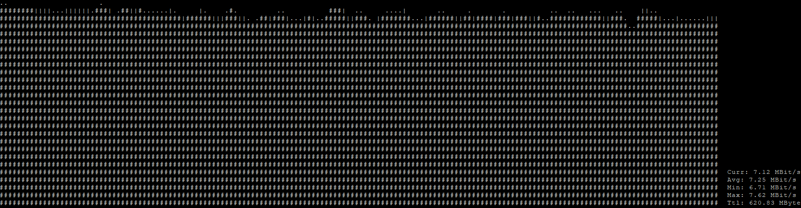

UnicornUDPFlooder is a fun project to play with RAW Python socket

# Demo

## Requirements

- Python >= 3.7

# Licence

The code is under CeCILL license.

You can find all details here: https://cecill.info/licences/Licence_CeCILL_V2.1-en.html

# Credits

Copyright © Ludovic Ortega, 2019

Contributor(s):

-Ortega Ludovic - ludovic.ortega@adminafk.fr
